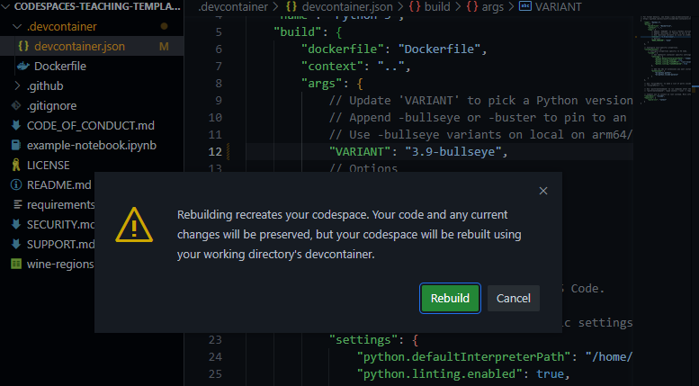

[](https://github.com/codespaces/new?hide_repo_select=true&ref=main&repo=526669888)

# What is GitHub Codespaces and how can I use it in my teaching?

## Introduction

A codespace is a development environment that's hosted in the cloud that you can configure.

## Why use it?

- Repeatable environment offering a 0-config experience.
- Runs in the cloud.
- Can be configured and customized.
- Integrates with your repositories on GitHub.

## Customization

You can customize your project for GitHub Codespaces by committing configuration files to your repository (often known as Configuration-as-Code), which creates a repeatable codespace configuration for all users of your project.

You can configure things like:

- Extensions, you can specify what extensions should be preinstalled.
- Dotfiles and settings.

> Learn more here, <https://docs.github.com/en/codespaces/customizing-your-codespace/personalizing-github-codespaces-for-your-account>

## For the Educator

For you as a teacher that means that you can create an environment, in the cloud, for your class that all students can use with zero or next to zero configuration regardless of what operating system they are using.

## Codespaces template

This repo is a GitHub template. The repo contains the following:

- [example-notebook.ipynb](./example-notebook.ipynb), This notebook uses the [Pandas](https://pandas.pydata.org/) library to teach basic operations with a small CSV (Comma Separated Value file) [dataset](./wine-regions.csv)
- `README.md`. This file describes this repository and what's in it.
- `LICENSE`, this project is under MIT license. Learn more by reading the [LICENSE](./LICENSE) file in this repo.
- `CONTRIBUTE`, this project welcomes contributions. Read more in [CONTRIBUTE](./CONTRIBUTE)

## -1- Run it

To run what's in this repo, you need to first start a Codespaces instance.

1. Navigate to the main page of the newly created repository.
1. Under the repository name, use the Code drop-down menu, and in the Codespaces tab, select "Create codespace on main".
   
1. Creating codespace

   


Next, we will run our app.

## -2- Inspect your codespaces environment

What you have at this point is a pre-configured environment where all the runtimes and libraries you need are already installed - a 0 config experience.

You also have a Jupyter Notebook that you can start using without any configuration.

> This environment will run the same regardless of whether your students are on Windows, macOS or Linux.

1. Open up your Jupyter Notebook file *exercise.ipynb* and note how you can add code and run it.

## Challenges

You can change your environment. Let us take you through two different challenges that you are likely to want to do.

### -1- Change Python runtime

Let's say you want to change what version of Python is installed. This is something you can control.

Open *.devcontainer/devcontainer.json* and replace the following section:

```json
"VARIANT": "3.8-bullseye"
```

with the following instruction:

```json
"VARIANT": "3.9-bullseye"
```

this change will use Python 3.9 instead of 3.8.

### -2- Add extension

Your environment comes with preinstalled extensions. You can change which extensions your codespaces environment starts with, here's how:

1. Open file *.devcontainer/devcontainer.json* and locate the following JSON element **extensions**:

   ```json
   "extensions": [
    "ms-python.python",
    "ms-python.vscode-pylance"
   ]
   ```

1. Add the following entry to **the extensions** list and add a comma on the previous extension:

   ```json
   "codespaces-Contrib.codeswing"
   ```
  
   What you did above was to add the unique identifier of an extension of the [CodeSwing extension](https://marketplace.visualstudio.com/items?itemName=codespaces-Contrib.codeswing). This will let Codespaces know that this extension should be pre-installed upon startup.
   
   Remainder: When you change any configuration on the json, a box will appear after saving.
   
   
   
   Click on rebuild. Wait for your codespace to rebuild the VS Code environment.
   

To find the unique identifier of an extension:

- Navigate to the extension's web page, like so <https://marketplace.visualstudio.com/items?itemName=codespaces-Contrib.codeswing>
- Locate the *Unique Identifier* field under **More info** section on your right side.

## Learn more

- [GitHub Codespaces docs overview](https://docs.github.com/en/codespaces/overview)
- [GitHub Codespaces docs quickstart](https://docs.github.com/en/codespaces/getting-started/quickstart)

